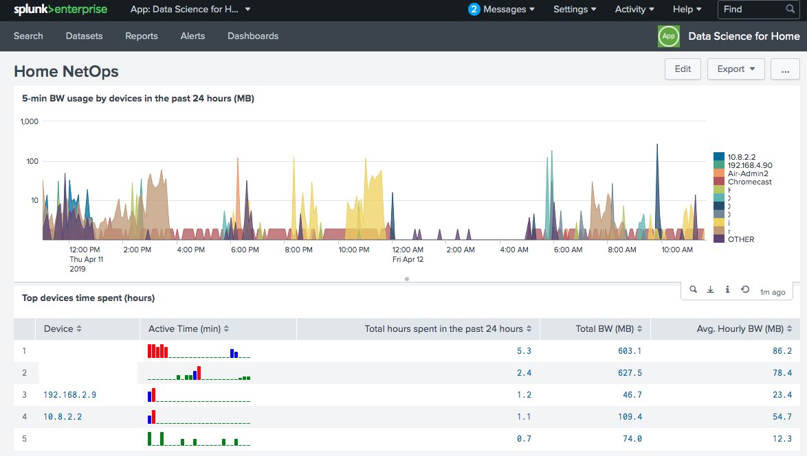

# splunk4home
Splunk4home is to use [Splunk](https://www.splunk.com) to view and manage home network. More precisely, Splunk4home develops scripts to collect data from routers, PCs, mobile devices, and other machineries found at home, then uses Splunk to fuse various data together to provide a coherent view of home network. Based on such view, home owners can take actions to better manage their devices, to protect their digital assets from cyber intruders, and to better understand network usage by their kids, etc..

Main features (planned):
* Connected devices management
* Bandwidth usage
* Security monitoring
* Destination intelligence
* Parental control

